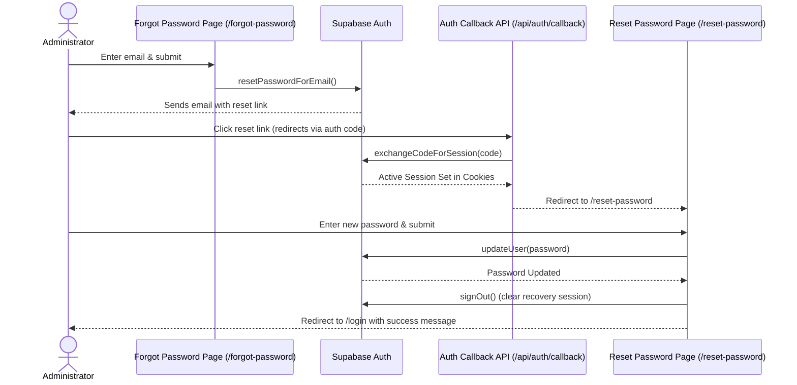

# Admin Password Reset Design Specification

## Goal
Implement a secure, user-friendly password reset flow for administrator accounts in the AirSense Admin Portal. This flow will allow admins who forgot their passwords to securely request a reset link via email, exchange the auth code for a session, and update their password.

---

## Architecture & Flow

The password reset process uses the standard Supabase Auth PKCE flow integrated with Next.js App Router:

---

## Detailed Components

### 1. Login Page Modifications
- **File**: `app/(auth)/login/page.tsx`
- **Change**: Add a "Forgot Password?" link next to the password field or directly below the card's form inputs.
- **Link Target**: `/forgot-password`

### 2. Forgot Password Request Page
- **File**: `app/(auth)/forgot-password/page.tsx`
- **Details**:
  - Styled with the standard AirSense theme (`#0e213b` card, `#0A1628` background, cyan buttons).
  - Form field: `email` (validated, required).
  - Call `supabase.auth.resetPasswordForEmail(email, { redirectTo: `${origin}/api/auth/callback?next=/reset-password` })`.
  - Handle success: Show inline success alert ("If your account exists, a reset link has been sent to your email address").
  - Handle error: Show standard validation or Supabase error toast.

### 3. Auth Callback Route Handler
- **File**: `app/api/auth/callback/route.ts`
- **Details**:
  - GET handler that extracts the query parameter `code`.
  - Exchanges it using `supabase.auth.exchangeCodeForSession(code)`.
  - Sets cookies for the session.
  - Redirects to `/reset-password`.
  - If error, redirects back to `/login?message=auth_error`.

### 4. Reset Password Form Page
- **File**: `app/(auth)/reset-password/page.tsx`
- **Details**:
  - Securely checks for an active session on mount. If no session, redirects immediately to `/login?message=access_denied`.
  - Form fields: `newPassword`, `confirmPassword`.
  - Client-side validation: Password must match, minimum 8 characters.
  - Call `supabase.auth.updateUser({ password: newPassword })`.
  - On success, call `supabase.auth.signOut()` to invalidate the recovery session and redirect to `/login?message=password_reset_success`.

---

## Verification Plan

### Manual Verification
1. Open `/login` page and verify the presence of the "Forgot Password?" link.
2. Click the link, verify redirection to `/forgot-password`.
3. Input a registered admin email and verify success message.
4. Open the received email and click the link to verify callback routing through `/api/auth/callback` to `/reset-password`.
5. Enter a new password on `/reset-password`, submit, and verify redirect to `/login` with a success message.
6. Verify logging in using the new credentials.
